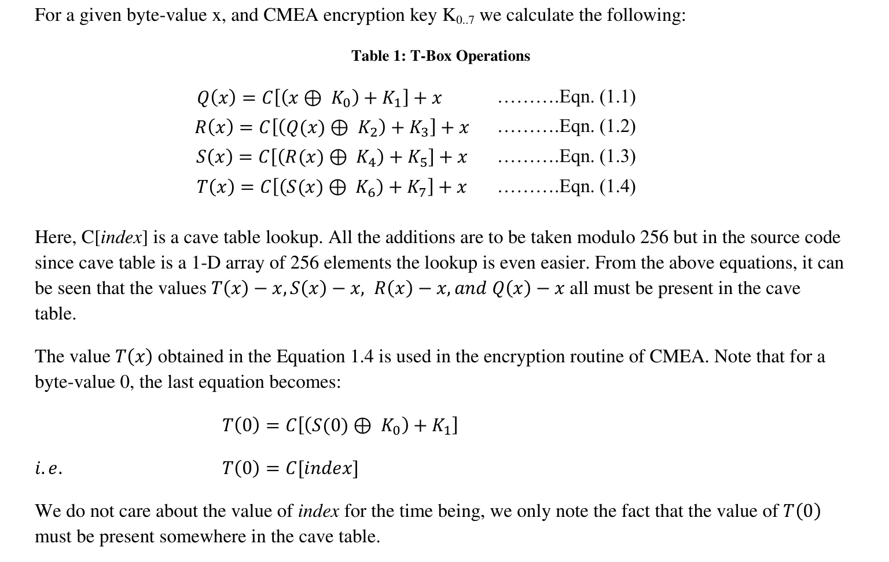
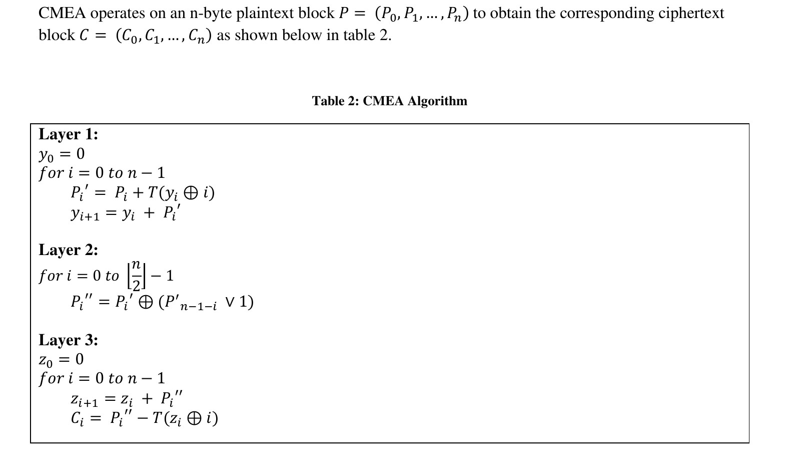
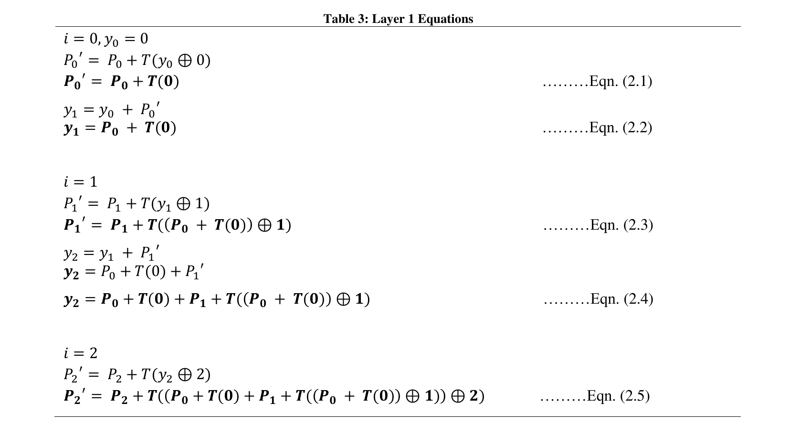
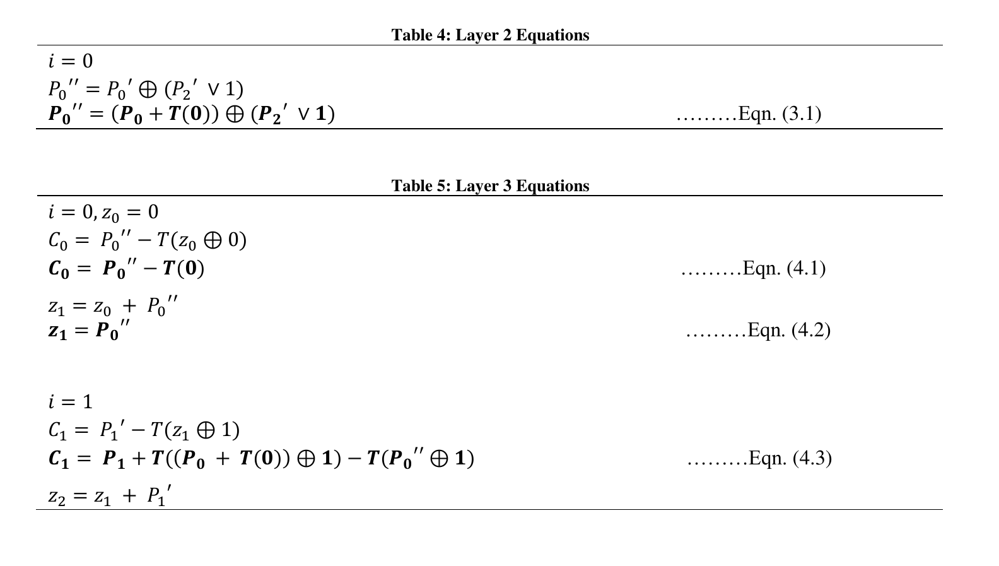
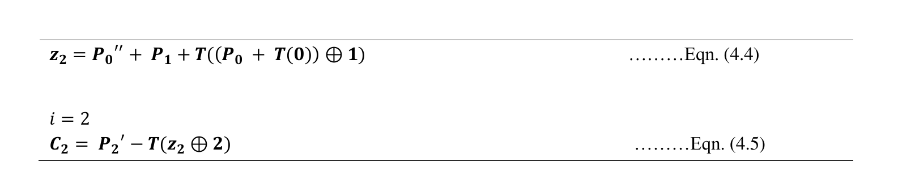
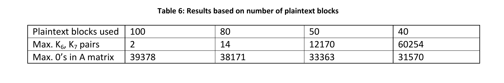
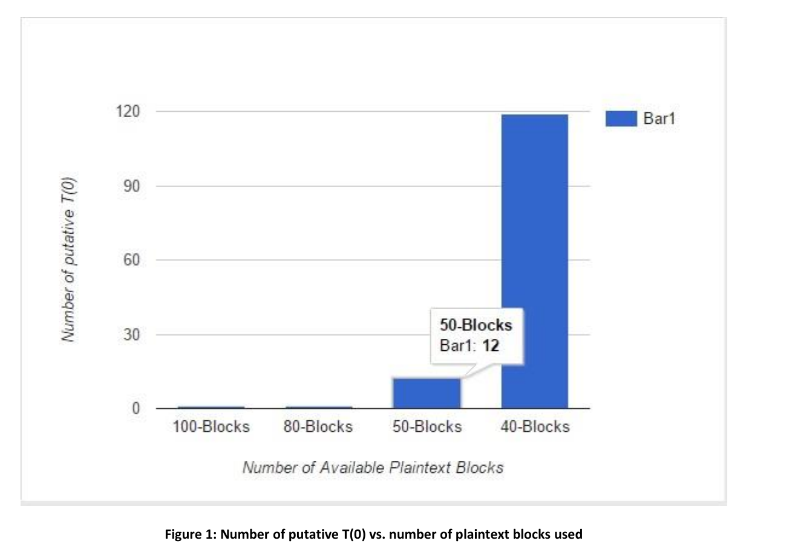
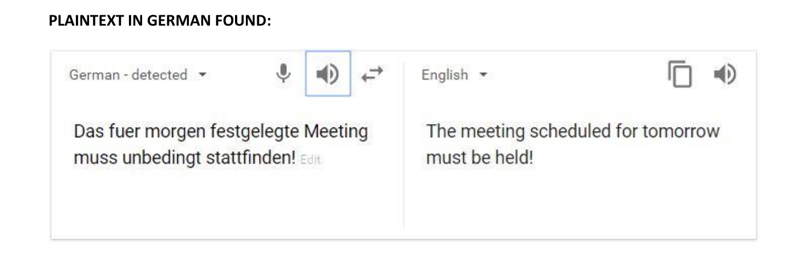

# Cryptoanalysis-of-CMEA-and-RSA
This project includes cryptoanalysis of CMEA and low exponenet RSA algorithm using known plaintext attack and Chinese Remainder Theorem respectively. 

<h1> CMEA (Cellular Message Encryption Algorithm) </h1>
CMEA is a block cipher which operates on blocks of the size of 2 to 6 bytes. CMEA was one of the four cryptographic primitives
used in the mobile communications network in the US. The key length of CMEA is 64 bit.

There is a known-plaintext attack which recovers the key (and thusthe whole plaintext) given only 40 to 100 known plaintext blocks.

<h1>Challenge Overview:</h1>
The challenge is to perform a known-plaintext-attack on CMEA cipher. 
In CMEA-II We have been given: 
Ciphertext File: cmea2Cipher.txt 
Plaintext File: cmea2InitPlain.txt 
Number of given plaintext blocks: 40 
In CMEA-I We have been given: 
Ciphertext File: cmea1Cipher.txt 
Plaintext File: cmea1InitPlain.txt 
Number of given plaintext blocks: 100 
The solution to the challenge is the complete plaintext corresponding to the ciphertext. 

<h1> CMEA Specification</h1>
<b>Block Length:</b> 3-byte 
<b>Key Length:</b> 64-bits (8-byte key) 
CMEA uses a function called as the T-box which in turn uses a lookup table called as the cave table. The function of T-box is given below in table 1. 
<b>Cave Table:</b> CMEA uses a 256-byte lookup table. But, there are only 164 distinct byte values that appear in the cave table. The cave table is fixed and it is a good idea to not the fact that only 164 byte-values appear in the cave table as it will be used later to our advantage during the known-plaintext attack.

<h1>Algorithm</h1>

<h1>Equations</h1>

<h1>Observations</h1>

<h2>CMEA-1 putative keys:</h2>

0x01, 0x02,0x03,0x04, 0x15, 0x16, 0x17, 0x18 
0x01, 0x02,0x03,0x04, 0x15, 0x16, 0x97, 0x98 
0x01, 0x02,0x03,0x04, 0x95, 0x96, 0x17, 0x18 
0x01, 0x02,0x03,0x04, 0x95, 0x96, 0x97, 0x98 

<h2>CMEA-1 Plaintext:</h2>
ABCDEFGHIJKLMNOPQRSTUVWXYZabcdefghijklmnopqrstuvwxyz0123456789AABBCCDDEEFFGGHHIIJJKK 
LLMMNNOOPPQQRRSSTTUUVVWWXXYYZZaabbccddeeffgghhiijjkkllmmnnooppqqrrssttuuvvwwxxyyzz00 
112233445566ZYXWVUTSRQPONMLKJIHGFEDCBAzyxwvutsrqponmlkjihgfedcba9876543210ZZYYXXWW 
VVUUTTSSRRQQPPOONNMMLLKKJJIIHHGGFFEEDDCCBBAAzzyyxxThis also seems a fitting occasion to 
notice the other hard works in that poem. Humpty-Dumpty's theory, of two meanings packed into one 
word like a portmanteau, seems to me the right explanation for all. 

<h2>CMEA 2 observations:</h2>
Number of known plaintext blocks = 40 
The number of putative T(0) generated = 75 
Maximum number of putative K6, K7 pairs = 52898 
Maximum number of 0’s in A matrix for putative T(0) values = 31436 
To solve CMEA 2 we would need to find putative key K0..7 for each of the 75 putative T(0) and for all K 6, K7 pairs and then check the output by decrypting the cipher text. This is a computationally intensive task to find the putative key K0..,7. As mentioned in [1] the expected number of such keys is about n4, where n is the number of (K6,K7) pairs. 

<h1> RSA </h1>
RSA is one of the first practical public-key cryptosystems and is widely used for secure data transmission. 
In such a cryptosystem, the encryption key is public and differs from the decryption key which is kept secret. 
In RSA, this asymmetry is based on the practical difficulty of factoring the product of two large prime numbers, the factoring problem.

<h1>Solution </h1>

<b>NOTE:</b> For more detailed explanation, please reach out to me at erajaypal91@gmail.com. 

